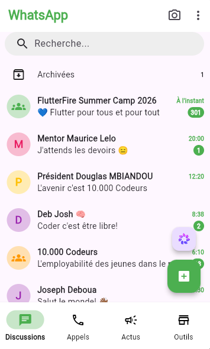
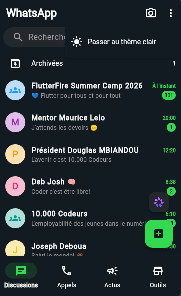
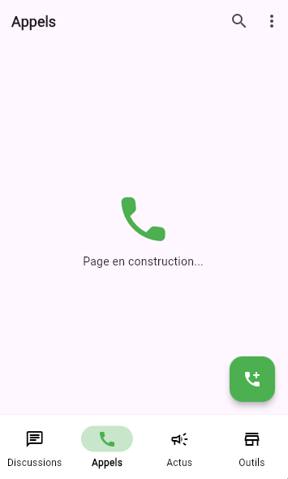
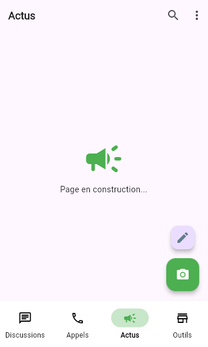
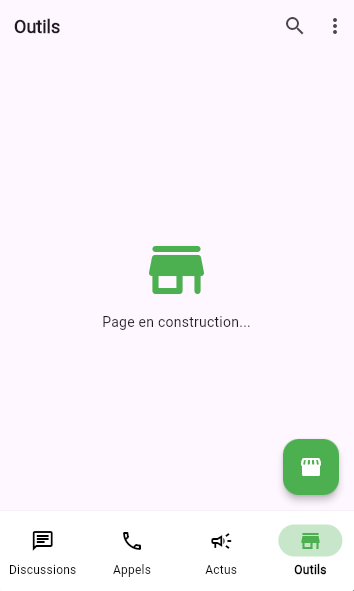

# <i style="color: #32D951">Zapp</i> - le meilleur clone partiel(pour l'instant) de WhatsApp

    

# Les fonctionnalités implémentées
- Splash screen natif s'adaptant aux thèmes(clair/sombre)
- Le changement de thème de l'application (light/dark)
- Listing des discussions
- Gestion dynamique des photos de profil des discussion en fonction de leur type (personne/groupe/communauté)
- La navigation entre les pages est effective

# Les fonctionnalités à venir
- Splash screen animé avec le logo de WhatsApp faisant la transition avec celui de Zapp
- Animer la transition entre les screens comme sur le vrai whatsapp
- Recherche d'une discussion selon les proprietes des chats grace a la barre de recherche déjà présente
- Filtrage des discussions selon leur état (toutes/non lues/groupes/communauté)
- Ajout de nouvelles discussions via le bouton(FloatingActionButton) se traouvant au chats_screen
- Implémentation des interface Inbox des discussions
- Full responsive design avec des layaout différents sur tablet et desktop

# Les dépendances utilisés
- ***go_router***: pour la gestion de la navigation et du routing (`flutter pub add go_router`)
- ***provider***: pour fournir le theme globale à l'app (`flutter pub add provider`)
- ***flutter_native_splash***: gestion du splash screen natif (`flutter pub add flutter_native_splash`)

# Screenshots de l'application <i style="color: #32D951">Zapp</i>
## Splash screens

    
    

## Page des discussions (Chats)

    
    

## Page des appels (Calls)

    

## Page des actus (Updates)

    

## Page des outils (Tools)

    

